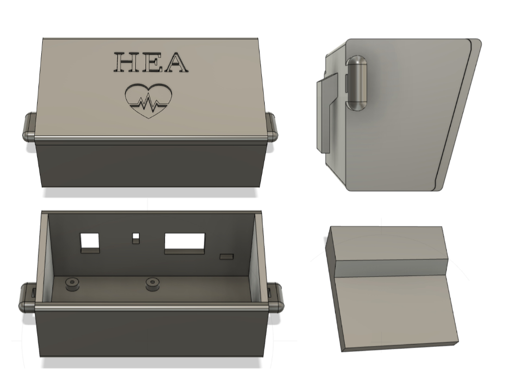

<h1 align="center"> AY2324_I_Project-6: HEA </h1>

<p align="center">
  
</p>

   <br> 
   <br> 
   
## Getting Started
### Clone the repository
Run the command on your terminal at the desired location:
```
git clone git@github.com:ltebs-polimi/AY2324_I_Project-6.git
```
### Dependencies
It is recommended to create a virtual environment to run the GUI. This can be done by running on your terminal:
```
python -m virtualenv GUI_venv
```
The latest versions of these libraries should then be installed within the virtual environment:
- ```PyQt5```
- ```numpy```
- ```scipy```
- ```pandas```
- ```openpyxl```
- ```pyqtgraph```
- ```os```
- ```sys```
- ```time```
- ```logging```
- ```struct```
## Filetree
Directories are organized as follows:
```
││├───CASE
│││   └──STL files
│││
││├───GUI
│││   ├──pyqt5_venv
│││   └──GUI.py
│││
││├───PCB
│││   ├──HEA.bdr
│││   └──HEA.sch
│││
││└───PSoC_code
││    ├──Oled-Psoc5
││    └──Stream mode.cydsn
││       │
││       ├───Generated_Source
││       │   └───PSoC5
││       └───TopDesign
││
│└───Validation_Study
│    ├──Output_Measurements
│    └──Plots
│
└───Images

```
   
## Intro
The aim of the present project is to develop a wearable device for the continuous monitoring of the heart rate, using the seismocardiography tecnique. 
  
### Seismocardiography
Continuous cardiac monitoring is necessary for the diagnosis of cardiovascular diseases. Medical emergencies caused by cardiac arrests can be prevented by a continuous cardiac monitoring, which can be easily provided by a wearable device. [^1]

Seismocardiography consists in the extraction of the heart rate value from the measurement of the vibration of the chest caused by the contraction of the heart, the closure of the cardiac valves and the ejection of the blood into the vascolature. [^1]  This term appeared in literature for the first time in the 90's. Vibrations induced by the cardiac activity are mainly correlated to valve closure (heart sounds) and cardiac systole. In particular, seismocardiographic movements at relatively low frequency reflect the recoil forces that results from the contraction of the heart muscle when it ejects blood into the vessels. These forces are responsible for body accelerations in the order of 5 mg. [^2]
  
Failing at reaching the same performances of other well established measurement techniques for the heart rate, seismocardiography didn't find a wide usage in the clinical practice. However, in the last 20 years, thanks to the development brought to the inertial sensors field by MEMS technology, this technique has been at the center of several studies. [^2] Appropriate sensors for seismoardiography are acceleroemeters and IMUs (6 axes accelerometer-gyroscope or 9 axes accelerometer-gyroscope-magnetometer). [^1] Studies present in literature investigated the usage of both single sensors and multiple sensors combined together, and vary in the site of measurement and type of processing utilized. 
  
With the spread of wearable devices and the lowering in their prices, it becomes important to further study the application of cheap and miniaturized sensors to perform biosignal analysis.
Accelerometers and ECG electrodes are common sensors inserted in smart garments such as T-shirts for the monitoring of the athlete performance and smart pajamas for the assessment of the quality of sleep. One of the main objectives in this field is the reduction in the number of the sensors needed to extract the wanted information. Limiting the electronics reduces both the production and the maintenance costs and simplifies the design of such garments. 

Most of the studies present in literature use just one accelerometer as sensor to study the heart rate acquisition in static conditions. Some more recent studies proposed the usage of a second accelerometer to measure the accelerations at the chest level not caused by the cardiac contraction, in order to remove motion artefacts that are superimposed to the heart signal and to make the tecnique effective even in conditions of light movement. [^3]
  
### Heart attack
The proposed solution is a device called "Heart attack" or "HEA" in short. It uses a single 3 axes accelerometer positioned on the chest in contact with the skin, connected through wires to a unit that can be worn on the belt or on the side with a shoulder strap, and that both provides a first interface with the user and manages the communication with a pc. A graphical user interface shows on a pc the result of the measurement and makes the utilizer able to connect and operate with the device. In short, the device records the data relative to the acceleration of the chest of the user and sends it to a pc that has previously been connected to the device throught the appropriate software. The processing of the raw data and the computation of the heart rate value is performed on the pc. Then, the extracted HR value is both sent back to the device, which uses it to manage the peripherals, and displayed on the pc screen both numerically and through a real-time plot. 

The initial solution aimed to incorporate the use of two accelerometers, but during the development process, it was decided to opt for a single accelerometer. This choice yielded satisfactory results while maintaining the simplicity and cost-effectiveness of the device in a hypothetical industrial context.
  
The details of the project are discussed in the following sections:
- [Hardware](#hardware)
- [Firmware](#firmware)
- [Communcation](#communication)
- [Processing](#processing)
- [Graphical user interface](#graphical-user-interface)
- [Acquisition Protocol](#acquisition-protocol) 
- [Clinical validation study](#clinical-validation-study) 
- [Limitations and future developments](#limitations-and-future-developments)
  

   <br> 
   
## Hardware
### Reference Folder: `PCB`, `Case_3Dprint`
  
HEA is composed by an accelerometer fixed in position on the chest of the user by a band and inserted in a protective shell, and by a central unit installed into a rigid case that can be worn on the belt, thanks to a clip, or on the side thanks to a shoulder strap.  

<br> 

<div align="center">


</div>
  
<br>
  
The electronic circuit has been simulated in breaboard before designing the PCB.   
The electronical components used for the main module are: 
- Psoc 5LP, accelerometer LIS3DH, bluetooth module HC-O6, OLED screen ElectroPeak 0.96'', RBG led, buzzer, 9V alkaline battery, switch, linear voltage regulator LM7805, resistors (220Ω 2x, 330Ω 4x, 1KΩ 4x, 10KΩ 2x), capacitor 100μF.
  
<br>  

<div align="center">


</div>
  
<br>
  
A reset circuit has been added to the main module in order to automatically reset the microcontroller every time the device is turned on.
The electronical components used for the reset circuit are: 
- Dual Operational Amplifier LMx58 Low-Power, resistors (220Ω 1X, 330Ω 1X, 10KΩ 1x), capacitor 470μF.
  
<br>  

<div align="center">
  


</div>

 <br> 
  
### Hardware functioning discussion:
- The accelerometer and the OLED screen communicate with the microcontroller via I2C, whereas the bluetooth module communicates via UART.
- The accelerometer has also a connection between its interrupt pin and a pin of the microcontroller, so that it can trigger an interrupt when the FIFO register is full. 
- The oled screen shows the name of the device on power on. After 5 seconds it switches to a second window that shows the heart rate value and battery level over time. When the streaming is ongoing, the OLED screen is updated every 5 seconds with the new istantaneous HR value. Every hour the battery level is sampled, this event triggers also an update of the OLED screen to display the updated battery level. 
- The RGB led communicates information about the connection status of the device. If the device is not connected it flashes a red light, if the device is connected but it is not streaming data it emits a stable green light, if the device is connected and it is streaming data it emits a stable blue light. 
- The buzzer can supply information about the state of the battery and about the heart rate value via an alarm. The alarm is triggered when the heart rate value overcomes 120 bpm (which means that the user is suffering tachycardia) or when the battery goes below 5% (a new battery is needed). The alarm lasts 3 seconds, then it is disabled for 30 seconds, after which, if the triggering condition is still present, it will turn on again. 
- The PSOC 5LP and all the peripherals run on 5V, so the 9V of the battery are reduced and stabilized to 5V by the linear voltage regulator. 
- Resistors are used to limit the current running in the RGB led and to reduce the TX signal sent by the microcontroller to the bluetooth module from 5V to 3.3V, to cope with the HC-06 limitations. 
- The 100μF capacitor grants a constant power supply even in case of spikes in the current request of the circuit. 
- A voltage divider is used to reduce the 9V of the battery to 5V in a proportional way, in order to sample such signal with a pin of the microcontroller connected to an ADC and to use it as indication of the battery residual charge.
- The PCB hosts the passive components (capacitor and resistors) and the headers for the pluggable components, providing a compact platform for all the elements.
- The reset circuit generates a 0V signal that lasts approximately 3 seconds when the device is turned on. This signal is generated at the output of a comparator powered between 5V and ground. The non inverting input of the comparator is connected to the positive terminal of a capacitor which is in series to a resitor. As soon as the device is switched on the capacitor starts to charge, when its voltage overcomes 3V (present at the inverting input of the comparator and generated by a voltage divider) the output of the comparator turns from 0V fo approximately 3.6V, ending the 0V signal. This 0V-2s pulse is sent to the reset pin of the microcontroller. 
  

### 3D printed case design discussion:
- The 3D printed case is meant to contain the PCB with all the peripherals except for the accelerometer, which is instead encapsulated in a protective shell and worn on the torso, fixed in position by an elastic band. Some windows in the upper panel of the case grant the visibility of the OLED screen and of the RGB led, provide a passage for the accelerometer cables and host the switch. The case can be worn on the belt thanks to a clip or on the side via a shoulder strap. The PCB is screwed inside the case whereas all the other components are glued in position. The cover can be easily removed and placed back in position thanks to velcro straps.
  

<div align="center">


  
</div>

<div align="center">


</div>


   <br> 
   
## Firmware
### Reference Folder: `PSoC_code`
The initial configuration state of each peripheral is stored within the EEPROM memory of the PSoC5 device, these are read at each power-on. Namely, the information stored concerns:
- The sentence to be displayed on the OLED screen at startup
- The color shown by the RBG led at startup
- The initial off state of the Buzzer
- The resolution in bit and the full scale in g of the accelerometer data

During normal running conditions, the EEPROM writing occurs only upon receiving a new bit resolution configuration or full-scale configuration, from the GUI, or when the device enters low-power mode, to ensure that the new settings are persistent upon the next power-on. An if statement on the macro `WRITE_EEPROM` is instead implemented for the first EEPROM programming, once done, the macro is set to False.

<br> 

<div align="center">


</div>
  
<br>

Recommended settings for HR measurement are: 10bit resolution and +2/-2g full scale. Entering low-power mode implies reducing the resolution to 8bit.
  
The OLED screen serves the purpose to provide an additional interface for the user and its management relies on an [open source library](https://github.com/NRDaza/Oled-Psoc5). When the device is powered on, the OLED screen shows the name of the device "Heart Attack" for 5 seconds, and then it shows the main window. The main window is composed by the acronym "HEA" at the top, followed by the indication on the current heart rate and by the residual battery charge. The heart rate corresponds to the instantaneous heart rate shown in the GUI and is updated every 5 seconds. On the other hand, the battery is sampled for the first time 5 seconds after powering on, then it is sampled again and updated on the OLED screen every hour. If the battery level is under 5% the sound alarm by the buzzer is turned on for 3 seconds and the device automatically enters in low power mode. The sound alarm is also activated if the measured heart rate exceeds 120bpm, as the device is intended for stationary use. After the 3 seconds, the buzzer undergoes a refractory period of 30 seconds before re-entering the triggerable mode.

The RBG LED is meant to signal the connection status of the device. Initially, while HEA is not yet paired with the laptop, the LED will blink in RED driven by a PWM signal with a period of 1 second and duty cycle of 50%. Successful pairing is then flagged via a fixed green light, while during data streaming a fixed blue light is shown.

<div align="center">


</div>

Accelerometer reading is performed exploiting the integrated 32-level FIFO register. The FIFO is filled at a 50Hz sampling frequency. As the last level is filled, the `OVRN` bit in the `FIFO_SRC_REG` is set HIGH triggering an interrupt service routine. Within the ISR, initial attempts at recovering the data consisted in reading each FIFO level one at a time and reconstructing the acceleration along each axis, before transmitting it via UART protocol to the GUI. Being implemented while using FIFO mode, this approach was faulty and resulted in hundreds of acceleration samples being lost, due to the fact that data collection is stopped until all registers are read and a different mode is selected. 

<br> 

<div align="center">


</div>
  
<br>

For this reason, Stream mode was implemented, in this case when the buffer is full, the FIFO index restarts from the beginning and older data is replaced by the current. To avoid the risk of overwriting samples, the reading procedure was sped up by shrinking the ISR to perform the reading of all the 192 bytes at once and transmitting them raw.

<br> 

<div align="center">


</div>
  
<br>

   <br> 
   
## Communication
### Reference Folder: `PSoC_code`, `GUI`
The visualization on the GUI of the acquired data is possible thanks to the serial communication that connects the microcontroller and the GUI interface via Bluetooth.
The port is automatically detected by clicking the button "Connect" (which triggers the sending of character "v") and waiting for the response from the microcontroller: if the line "Go $$$" is correctly received, then the COM port is open and data streaming can occur. Sending a character from keyboard makes sure that only the wanted device is called, which in this case is redundant dealing with only one device, but it increases the robustness of the application. 

Once the line is received, the GUI is ready to receive the current settings saved in the EEPROM memory of the device; this is done by sending via software the letter "k", whose purpose from the PSoC side is to trigger a case devolved to sending the bit resolution and the g resolution values.

<br> 

<div align="center">


</div>
  
<br>

If the status of the device is connected, then data streaming can occur, depending on the character (or the shortcut) that the user presses: if "Start acquisition" (or CTRL+b), streaming starts, if "Stop acquisition" (or CTRL+f), streaming stops. Of note, the shortcut to stop streaming was changed from CTRL+s to CTRL+f, because CTRL+s was then used to implement data downloading on an excel file (see section GUI for more details). However, the CTRL+f shortcut still enables the sending of the "s" character, which is the one the PSoC recognizes to stop data streaming. 
The management of the possible variables involved in the bidirectional communication between PSoC and GUI is assolved through a "while" cycle, which is active whenever the condition of connected device and correct string received are satisfied. The "while" comprehends a number of "if" conditions equal to the number of possible buffers, distinguishable thanks to their headers, and has a frequency equal to the accelerometer ISR triggering; therefore, at every iteration of the while loop, 32 samples of acceleration are acquired. The acquisition comprehends unpacking the 192 bytes, converting them properly according to the `BIT_RESOLUTION` and `G_RESOLUTION` global variables, and saving them in variables that can be exploited to update the graph. 

The "if" condition involved in data reading is responsible of triggering the processing flag, which starts the processing chain that will be explained in the following section. Among the other steps, the dispatch of the heart rate value that will be streamed on the OLED, is also included.  

The other "if" conditions are devoted to acquire respectively: the eventual data from the second accelerometer, the g resolution, assigned here to `G_RESOLUTION`, the bit resolution, assigned here to `BIT_RESOLUTION`, and the power mode, which allows to set the `LOW_BATTERY` global, and to show an appropriate warning to the user to suggest the substitution of the battery. The `BIT_RESOLUTION` value can toggle between 8 and 10 bits, the `G_RESOLUTION` value can toggle between 2 and 4 g; these values are consistent with the modality in which the accelerometer is used - using its built-in FIFO - and with the typical value ranges of the specific application - seismocardiography. Of note, these values can be set by the user throughout the acquisition through appropriate buttons (which will be described in section GUI); nevertheless, there's a mismatch of 32 samples between the updating on the software and on the firmware, causing that small portion to have inaccurate values; this can be signaled to the user through a proper warning. 

<br> 

<div align="center">


</div>
  
<br>

   <br> 
   
## Processing
### Reference Folder: `GUI`
Different processing strategies have been investigated. Among the ones showing promissing results, the choosen one shows good concordance with the gold standard device used as reference for the wider HR interval. 
The processing of the signal is composed by the following steps: 
  
- A vector containing 1500 samples (corresponding to 30 seconds since the sampling frequency is 50Hz) of the acceleration on the Z axes is the input to the processing chain.
- Rectification is applied to the raw data vector.
- A Butterworth high pass filter of the fourth order with cut off frequency of 18Hz extracts the cardiac sounds from the overall chest perpendicular acceleration signal. [^2]
- The first 100 samples of the resulting vector are removed to clean the distortion introuced by the filter, the remaining samples are rectified.
- The processed signal is normalized with the z-score and then rectified.
- A threshold equal to the 80% of the variance of the energy of the final signal is computed. [^1]
- The function find peaks of the scipy library extracts the peaks showing the closure of the aortic valve (cardiac event that causes the maximal vibration of the chest).
- The HR value is computed as the mean of the time intervals between the detected peaks.
  
<br> 

<div align="center">


</div>
  
<br>

- This processing is applied every time a new group of 32 samples is delivered to the pc (approximately every 0.64 seconds).
- The value of HR istantaneous is updated every 5 seconds and it is computed as the mean of all the HR values computed in the 5 seconds window prior to the update.
- The value of HR mean is updated every 60 seconds and it is computed as the mean of all the HR values computed in the 60 seconds window prior to the update.
  
It is worth mentioning also the following processing which applies a very different approach and that shows good performances in the range 60bpm-80bpm:
- A vector containing 1500 samples of the acceleration on the Z axes is the input to the processing chain.
- The absolute value of such raw data is first denoised by using a Savitzky-Golay filter. In particular this filter extracts the respiratory signal from the raw data, so by subtracting it from the raw data we can already eliminate a big noise component. [^1]
- A Butterworth fitler of the fourth order between 0.6Hz and 3.6Hz eliminates the freqeuncy components that do not contain the heart rate signal. 
- The processed signal is normalized with the z-score. 
- Thanks to a threshold equal to the 80% of the standard deviation of the analyzed signal it is possible to determine the peaks linked to the valve activity. 
- Once the time istants associated with such peaks are extracted, the heart rate value can be computed from the time interval between peaks. 
  

   <br> 
   
## Graphical user interface
### Reference Folder: `GUI`
The graphical user interface incorporates all the features necessary to communicate with the device in one window.

To ease the connection with the device, the GUI is equipped with a scroll down menu and two buttons: "Scan" and "Connect to port {}". The box contains the list of serial ports that were found after the serial scan at the start of the GUI. In case it was started before the Bluetooth connection was enabled, the button Scan allows to call the serial scan again, thanks to a signal emitted by the SerialScanner class, and to update the list of ports in the combo box. Finally, the Connect button allows the actual connection with the device, only if the COM port is correct and the device sent the correct string. 

The graphical interface includes a dynamic graph window facilitating the visualization of both raw and processed data. 
The plotting commences after an initial 45-second calibration phase initiated by pressing the Start button. Utilizing the PyQtGraph Python library, the plot displays multiples of 32 samples. 
The "ready" and "ready processing" flags in the serial worker are set to 1 upon the availability of new samples. 
Every second, the Main Window, driven by a timer, checks these flags. If they equal one, the acquired samples are passed to the relevant function in the Main Window, plotted, 
and then the flags are reset to 0 until new samples are acquired. 
A button beneath the graph allows users to toggle between visualizing raw and processed data. Additionally, two buttons enable users to select the background color of the plot (light or dark mode) and clear the graph view.

On the right side of the GUI, editable lines allow users to input personal data about subjects. These data are utilized to create filenames when saving files (see details below).

Two LCD displays provide real-time visualization of instantaneous HR and mean HR. The instantaneous HR is updated every 5 seconds to enhance stability in the displayed value. The mean HR is updated every minute, calculated as the average of the last 12 samples of instantaneous HR shown.

The File menu bar encompasses three actions. The first two actions, "Start Acquisition" and "Stop Acquisition", have been previously discussed in the Communication section. 
The third action, "Save Data," enables users to contemporaneously save two Excel files: one containing raw data values and the other containing instantaneous HR values. 
Filenames are generated based on the user-entered data in the editable lines, structured as follows:
- Raw_data = '{name}_{surname}_{age}.xlsx'
- Instantaneous_HR = f'{name}_{surname}_{age}_HR.xlsx'

These files are intended for more robust offline analysis.

The Settings menu bar offers two actions allowing users to select the desired bit resolution and full scale by toggling between the two available values. 
The current values are continuously displayed on the screen.

Any event from the GUI raising an error is manifested to the user in the form of message boxes with informative text. 

   <br> 

## Acquisition Protocol

Before each acquisition, a protocol was formulated and followed to ensure consistency in results, minimizing possible errors and biases that may compromise the quality of data.

The protocol is articulated in the following steps:

__1. Preparation__: 
- Clean the skin where the accelerometer will be attached to ensure proper adhesion and minimize interference from sweat.
- Choose an appropriate location for attachment based on the anatomical characteristics of the subject’s chest.
- If it's possible to feel the heartbeat by lightly touching the protective shell encapsulating the accelerometer, then the positioning is valid.
- Ensure the device is fully charged or has sufficient battery life to support the duration of data collection.
 
__2. Attachment__:
- Securely affix the accelerometer device to the chosen location with the help of another person.
- Double check the fit to ensure the device is sufficiently but not overly tight to avoid discomfort and allow for normal breathing.

__3. Subject Positioning__:

Three conditions were tested:

- __Seated__: the subject is instructed to sit comfortably with their back supported and feet flat on the ground. Arms are resting on a table and the pulse-oximeter to monitor the reference heart rate is applied to the right index finger. HEA is placed on the table as well in front of the subject, cables are lifted to prevent artifacts due to their breathing-induced dragging on the table.
- __Upright__: the subject is standing straight with minimal movement. Again the pulse-oximeter is applied to the right index finger while the hand is resting on a flat surface. HEA is worn in the belt-like fashion ensuring that cables are not constrained by any strap.
- __Lying down__: the subject lies on an even surface in supine position, while the pulse-oximeter is applied to the right index finger. HEA is placed on the subject’s right side with cables passing over the respective arm.
  
__4. Data collection__: 

Once the previous steps are correctly performed and the subject is ready, data streaming from the device is started. Each acquisition was obtained for a duration of 10 minutes and data was collected every 5 seconds, as the OLED display of HEA is updated, or up to the acquisition of 100 samples. 

   <br> 
   
## Clinical validation study
### Reference Folder: `Statistical_Analysis`
In order to assess the quality of the device a small clinical validation study has been performed. 
To assess the applicability of a measuring instrument in a clinical context, it is necessary to evaluate its validity and reliability (intra- and inter-operator). In cases where such an instrument operates without the intervention of an operator, the validity of its measurements remains the major determining parameter.
Therefore, it is essential to compare the new measuring instrument under analysis with one that is already certified and validated, considered the gold standard. If it is proven that the distributions of measurements from the two devices are strongly correlated, and this assertion holds statistical significance, then the validity of the measurements of the new measuring instrument has been demonstrated.
The clinically validated measurement system used as gold standard in the present study is a Pulse Oximeter A340 produced by Aeon Technology.

The first step involves plotting the coupled measurements obtained from both the new instrument and the gold standard reference. From those plots it is possible to qualitatively analyze the trends of the measurements and the presence of possible biases.
Then some basic statistics are computed (error = Hea measurement - Pulse Oximeter measurement): mean error, mean absolute error, maximum absolute error, minimum absolute error, standard deviation of the absolute error, root mean square error. [^1]
The interpretation of those statistics is straight forward: the lower the better. In the current project a deviation of ±5bpm from the measurements of the gold standard device is considered acceptable.

To verify the correlation between the two data distributions, it is first necessary to determine whether these distributions are normal or not. If both distributions are normal, then the Pearson coefficient is used; otherwise, the Spearman rank correlation coefficient is employed. [^4] The normality of data in the case of small sample sizes is assessed using the Shapiro-Wilk test. [^5]
Both quantitative analyses described above have a qualitative counterpart consisting of interpretable graphs: QQ-plot for normality verification and Bland-Altman plot for correlation verification, with the limits of agreement computed as 1.96 * standard deviation of the differences. [^6]
If the calculated validity coefficient exceeds the threshold of 0.7, then the new measuring instrument is considered valid.
An interpretation commonly used for the correlation coefficient is: 0.90 to 1.00 = excellent, 0.70 to 0.89 = good, 0.50 to 0.69 = moderate, 0.30 to 0.49 = low, <0.30 negligible. [^7]
The minimum number of data points for each distribution should be 20 (significance level 0.05 (alpha), power 0.20 (beta), assuming a moderate correlation between measurements). [^8]

Several acquisitions have been performed during the course of the project on different partecipants that varied for gender and chest anatomy. Those acquisitions have been taken under a multitude of settings: static, with slight motion, with wide movements, seated, standing, laying down. Also different sensor positionings over the chest of the patient have been experimented. The various testing conditions determine the bpm range that is explored during the acquisition. Those measurements have been used to reject inadequate processing methods or sensor positionings. In the end, the choosen processing algorithm described in the section "Processing" has been analysed through six acquisitions perfomed on the same subject with the following settings: two seated, two standing, two laying down, all in static conditions and at rest. The acquisition protocol followed is descrived in the section "Acquisition Protocol". 

The following table shows the results of the statistical analysis of the processing algorytm currently implementend in the device. 

<br> 

<div align="center">


</div>
  
<br>

Mean error, MAE, RMSE show results all below the 5bpm target under all three of the different measurements conditions. The correlation has in the end always been computed through the Spearman rank correlation coefficient since the data recorded by the Pulse Oximeter always resulted not normal. Good correlation results are obtained only in the standing position, while in the laying down position and in the seated position not only the results of the coefficient are too low to determine a strong correlation, but they also vary significantly between the two acquisitions. 

From the analysis of the plots below we can see that the high correlation highlighted in the standing acquisitions is linked to the capability of HEA in correctly following the big variations of the heart rate over time, like for example when this one increases or decreases in a continuous way from 75bpm to 85bpm in the "standing" acquisitions. It is also possible to link the worse results got in the other two measurement conditions to the incapability of HEA in showing a stable heart rate value when its variations are in a more limited range, as can be seen both in the "seated" and in the "lying down" acquisitions.

<br> 

<div align="center">


</div>
  
<br>

The Bland-Altman plots show no bias in all the measurements sets with the exception of the first seated axquisition, where for lower HR values HEA tents to underestimate the recorded value. This limitation of the device should be further investigated through more acquisitions. 

<br> 

<div align="center">


</div>
  
<br>

In conclusion, on one hand the results are promising since the computed errors are all below the target error of ±5bpm, on the other hand a more in-depth statistical analysis would be required to assess correctly the correlation between the measurements of the two devices. This would consist in the application of the same approach described in the current chapter, but on a wider database, containing measurements made on a bigger cohort of participants and under a wider range of measurement conditions. 

<br>

## Limitations and future developments

Two main challenges have been identified for the device, the primary being the limited cohort size of partecipants on which the device has been tested, and the second being the requirement of the stillness of the subject to properly estimate heart rate. 

If by testing the device on a wider population the results obtained are subject dependent, a possible solution may involve tailoring the processing algorithms based on individual subject characteristics such as height, weight, age, and sex. By incorporating these variables into the processing framework, the device can potentially yield more accurate and reliable heart rate measurements across a diverse range of users.

To address the second issue, we propose the integration of two accelerometers to enable motion compensation. This approach aims to mitigate the impact of movement on heart rate estimation, thereby enhancing the device's performance in dynamic scenarios.

In conclusion, we believe that the potential solutions identified will improve the device's overall functionality leading to the possibility of integrating it into sensorized garments for everyday monitoring purposes.

*** 

## Authors

- matteo2.mentasti@mail.polimi.it
- alberto.pettenella@mail.polimi.it
- raffaella.salama@mail.polimi.it
- francesca.vacca@mail.polimi.it

<br>

## References
[^1]: H. Lee, H. Lee, and M. Whang, “An enhanced method to estimate heart rate from seismocardiography via ensemble averaging of body movements at six degrees of freedom,” Sensors (Switzerland), vol. 18, no. 1, pp. 1–12, 2018, doi: 10.3390/s18010238.
[^2]: M. Castiglioni, P; Faini, A; Parati, G; Di Rienzo, “Wearable seismocardiography. - MEDLINE® - ProQuest,” pp. 3954–3957, 2007, [Online]. Available: http://search.proquest.com.zorac.aub.aau.dk/medline/docview/68521306/DE9C4DD26AC74FADPQ/3?accountid=8144.
[^3]: L. Luu and A. Dinh, “Artifact noise removal techniques on seismocardiogram using two tri-axial accelerometers,” Sensors (Switzerland), vol. 18, no. 4, 2018, doi: 10.3390/s18041067.
[^4]: Pozzolo P. Coefficiente di correlazione lineare r di Pearson. Published 2020. Accessed June 28, 2022. 
https://paolapozzolo.it/coefficiente-correlazione-statistica-pearson/ 
[^5]: Pozzolo P. La distribuzione normale spiegata semplice. Published 2020. Accessed June 28, 2022. 
https://paolapozzolo.it/distribuzione-normale/ 
[^6]: F. Jacobs, J. Scheerhoorn, E. Mestrom, J. van der Stam, R. Arthur Bouwman, and S. Nienhuijs, “Reliability of heart rate and respiration rate measurements with a wireless accelerometer in postbariatric recovery,” PLoS One, vol. 16, no. 4 April 2021, 2021, doi: 10.1371/journal.pone.0247903.
[^7]: M. M. Mukaka, “Correlation coefficient and its use,” Malawi Med. J., vol. 24, no. September, pp. 69–71, 2012.
[^8]: M. Parati et al., “Video-based Goniometer Applications for Measuring Knee Joint Angles during Walking in Neurological Patients: A Validity, Reliability and Usability Study,” Sensors, vol. 23, no. 4, 2023, doi: 10.3390/s23042232.
